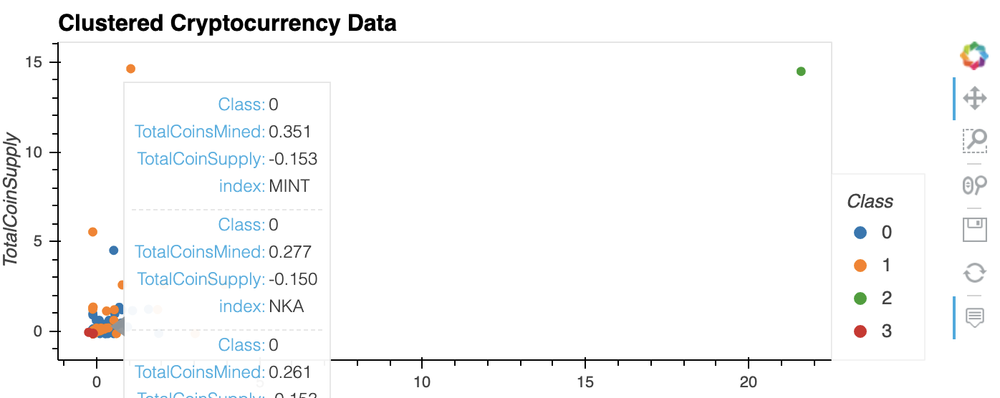
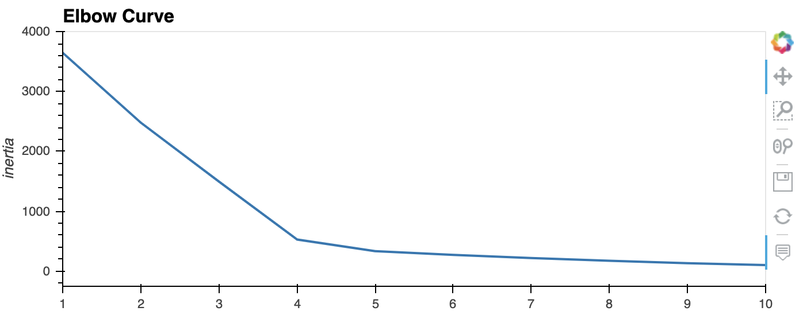

# Clustering_Crypto

*This repository contains the Unit 13 Unsupervised Learning homework assignment, "Clustering Crypto"  in the FinTech bootcamp course at the University of Toronto's School of Continuing Studies.*

---

# Table of Contents

- [Project Description](#Project-Objectives)
- [Installation Requirements](#Installation-Requirements)
- [File Contents](#File-Contents)

---

## Project Objectives

The following Clustering Crypto Jupyter Notebook uses unsupervised learning skills to cluster cryptocurrencies and create plots to present the results. 

The notebook seeks to accomplish the following tasks:

- Data preprocessing
- Reducing data dimensions using PCA
- Clustering Cryptocurrencies using K-Means
- Visualize the results

---